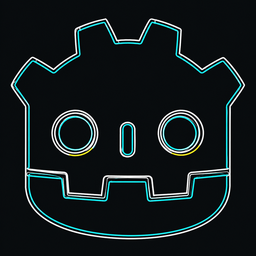

<!-- markdownlint-disable MD033 MD041 -->
<div align="center">


[](https://marketplace.visualstudio.com/items?itemName=fairyan.godot-shader-for-vscode)

</div>

<p align="center">
  
</p>

# Godot Shader for VS Code

> 🌐 [简体中文](./README-zh.md)

The best Godot Shader development extension — 20 providers, 160+ built-ins, 74 functions, 65 snippets, fully bilingual (zh/en).

---

## Install

[](https://marketplace.visualstudio.com/items?itemName=fairyan.godot-shader-for-vscode)

### Method 1: VS Code Marketplace (Recommended)

1. Visit [VS Code Marketplace](https://marketplace.visualstudio.com/) and search for **Godot Shader for VS Code** or open directly: [https://marketplace.visualstudio.com/items?itemName=fairyan.godot-shader-for-vscode](https://marketplace.visualstudio.com/items?itemName=fairyan.godot-shader-for-vscode)
2. Or open VS Code, click the **Extensions** icon in the Activity Bar (or press `Ctrl+Shift+X`), then search for **Godot Shader for VS Code**
3. Click **Install**

### Method 2: Build from Source

```bash
git clone https://github.com/yanhuifair/Godot-Shader-For-VScode.git
cd Godot-Shader-For-VScode
npm install
npx vsce package
```

Then in VS Code: `Ctrl+Shift+P` → **Extensions: Install from VSIX...** → select the generated `.vsix` file.

> After installation, `.gdshader` and `.gdshaderinc` files are automatically activated — no extra configuration needed.

---

## Features

### Code Intelligence

#### Context-aware Completion — `shader_type`, `render_mode`, `stencil_mode`, `uniform` types, `void` functions, hints, `#include` paths — all filtered by current shader type.

```glsl
shader_type spatial;                    // ← spatial / canvas_item / sky / fog / particles
render_mode blend_mix, cull_disabled;   // ← auto-completes valid modes for spatial
uniform float strength : hint_range(    // ← hint completions (source_color, filter_linear, …)
#                                       // ← preprocessor: #ifdef, #include, #define, …
#include "                              // ← workspace .gdshaderinc path completions
```

#### Hover Documentation

Type, description, available shader types, return value ranges, and usage examples.

```glsl
sin(                                  // hover → Signature: sin(float x)
dot(normal, light_dir)                // hover → Returns: scalar | Example: dot(normal, light_dir)
COLOR                                 // hover → Type: vec4 | Available in: canvas_item, spatial
```

#### Signature Help

Parameter hints for all built-in functions.

```glsl
mix(█                                 // mix(vecX a, vecX b, float|vecX t)
clamp(█                               // clamp(vecX x, vecX|float min, vecX|float max)
```

#### Inlay Hints

Parameter names inline, including user-defined functions. Configurable on/off.

```glsl
mix(x: color1, y: color2, t: 0.5)    // built-in functions
my_func(n: 10, flag: true)            // user-defined functions
```

#### CodeLens

Reference counts.

```glsl
uniform float strength;               // 3 references
void fragment() { … }                 // 1 reference
```

### Diagnostics

**17 Rules** — Smart filtering skips comments and strings.

```glsl
shader_type spatial;                  // ✅ valid
shader_type unknown;                  // ❌ Invalid shader_type: unknown

render_mode invalid_mode;             // ❌ 'invalid_mode' is invalid for spatial

uniform int value;                    // ❌ Invalid type 'int' (uniforms can't be int)

// { " }                               // ✅ braces in comments/strings ignored
```

| Rule | Example |
|------|---------|
| `shader_type` validation | `shader_type unknown;` -> error |
| Brace matching | `void f() {` without `}` -> missing closing brace |
| Semicolon | `COLOR = vec3(1.0)` -> missing `;` |
| render_mode | `render_mode bad_mode;` -> invalid for current type |
| Reserved words | `void main() {}` -> `main` is reserved |
| Built-in scope | `EYEDIR` in spatial -> not available |
| Duplicate declarations | Two `uniform float x;` -> duplicate |
| const init | `const float x;` -> must be initialized |
| Control flow | `break` outside loop/switch -> error |
| stencil_mode | `stencil_mode read;` without alpha -> warning |
| Number format | `1.5.5` -> invalid number |
| Function availability | `void sky()` in spatial -> error |
| Unused variables | `uniform float x;` never used -> hint |
| Performance (strict mode) | `discard` in fragment -> info |
| Texture in loop (strict) | `for(…){ texture(…); }` -> warning |

### Formatting

**Full document & range formatting** with switch/case, operator spacing, block-comment protection.

```glsl
// Before
void fragment(){COLOR=vec3(1.0,0.5,0.2);}

// After (Shift+Alt+F)
void fragment() {
    COLOR = vec3(1.0, 0.5, 0.2);
}
```

**Configurable brace style** — same-line (default) or new-line.

```glsl
// "godot-shader.formatting.braceNewLine": false (default)
void fragment() {
    // …
}

// "godot-shader.formatting.braceNewLine": true
void fragment()
{
    // …
}
```

**Preprocessor directives** always at column 0:

```glsl
// Always stays at column 0 regardless of nesting
#ifdef DEBUG
#define MAX_ITER 32
#endif
```

### Navigation

| Action | Shortcut | Example |
|--------|----------|---------|
| Go to Definition | `F12` | `uniform float x` → jumps to declaration |
| Find References | `Shift+F12` | Shows all usages of a symbol |
| Rename | `F2` | Rename all occurrences at once |
| Workspace Symbols | `Ctrl+T` | Search uniforms/functions across all `.gdshader` files |
| Document Links | Ctrl+Click | `#include "common.gdshaderinc"` → opens the file |
| Selection Range | `Alt+Shift+→` | `word` → `line` → `{ block }` → `void f() {…}` → full doc |
| Outline | Sidebar | Shows uniforms, varyings, functions in tree view |

### Visual

**Semantic Highlighting** — each token type gets a distinct color:

```glsl
uniform float strength;     // keyword  | type  | variable-name
COLOR = vec3(1.0, 0.5, 0.2); // built-in | type | number | number | number
void fragment() { … }       // keyword  | function-name
```

**`#if 0` Block Dimming** — disabled code visually faded:

```glsl
#if 0
// Everything here appears dimmed
vec3 disabled_color = vec3(1.0, 0.0, 0.0);
float disabled_value = 1.0;
#endif
```

**Color Picker** — click color values:

```glsl
vec3 sky = vec3(0.3, 0.5, 1.0);     // click the vec3 → color picker
vec4 col = vec4(1.0, 0.5, 0.2, 1.0); // click the vec4 → color picker
#define BG_COLOR #478cbf             // click the hex → color picker
```

**Status Bar** — shows current shader type at bottom right.

### Quick Fixes (`Ctrl+.`)

```glsl
// Before: missing semicolon
vec3 col = vec3(1.0)
// Quick Fix: Add ;

// Before: no shader_type
render_mode unshaded;
// Quick Fix: Add shader_type canvas_item;

// Before: missing closing brace
void fragment() {
    COLOR = vec3(1.0);
// Quick Fix: Add }
```

---

## Usage

| Shortcut | Action |
|----------|--------|
| `Ctrl+Space` | Trigger completion |
| `Shift+Alt+F` | Format document |
| `F12` | Go to definition |
| `Shift+F12` | Find references |
| `F2` | Rename symbol |
| `Ctrl+T` | Workspace symbols |
| `Ctrl+.` | Quick fix |
| `Alt+Shift+→` | Expand selection |

<details>
<summary><b>Snippets</b> (65 total)</summary>

| Prefix | Output |
|--------|--------|
| `shader-{canvas,spatial,sky,fog,particles}` | Full shader templates |
| `shader-{canvas,spatial}-full` | Templates with all sections |
| `func-{vertex,fragment,light}` `sky-func` `fog-func` | Function stubs |
| `uniform` `uniform-{range,color,texture,filter}` | Uniform declarations |
| `varying` | Varying declaration |
| `if` `ifelse` `for` `switch` | Control flow |
| `set-{color,albedo,metallic,roughness,emission}` | Output assignments |
| `ctor-{vec2,vec3,vec4,mat4}` | Constructors |
| `math-{clamp,lerp,normalize}` | Math operations |
| `sample-{texture,texturelod}` | Texture sampling |
| `#ifdef` `#ifndef` `#include` | Preprocessor (auto-inserts `#endif`) |
</details>

---

## Configuration

| Setting | Default | Description |
|---------|---------|-------------|
| `godot-shader.general.language` | `en` | UI language: `en` / `zh` |
| `godot-shader.diagnostics.checkBuiltinScope` | `true` | Validate built-in variable scope per shader type |
| `godot-shader.diagnostics.strictMode` | `false` | Extra warnings (discard perf, texture-in-loop) |
| `godot-shader.formatting.braceNewLine` | `false` | Place `{` on new line |
| `godot-shader.inlayHints.showParameterNames` | `true` | Show parameter name hints |
| `godot-shader.colorPicker.enabled` | `true` | Show color picker for color values |

---

## Project Structure

```text
src/
  extension.ts              # Entry point — registers all providers
  shader-data.ts             # 160+ built-ins, 74 functions, types, keywords, render modes
  i18n.ts                    # Bilingual translation (zh/en)
  en-descriptions.ts         # 380+ English descriptions
  utils.ts                   # Shared utilities
  features/
    completion.ts            # Context-aware completion + #include paths + preprocessor
    hover.ts                 # Hover docs + examples + return values
    diagnostics.ts           # 17 diagnostic rules
    formatting.ts            # Document & range formatting + brace style
    signature-help.ts        # Function parameter hints
    code-actions.ts          # Quick fixes
    folding.ts               # Code folding (brace + function detection)
    semantic-tokens.ts       # Semantic highlighting + #if 0 dimming
    definition.ts            # Go-to-definition + #include jump
    references.ts            # Find all references
    rename.ts                # Symbol rename
    highlight.ts             # Document highlights
    color-picker.ts          # vec3/vec4/hex color picker
    workspace-symbols.ts     # Cross-file symbol search (cached)
    symbol-provider.ts       # Outline & breadcrumbs
    inlay-hints.ts           # Parameter name hints (built-in + user functions)
    code-lens.ts             # Reference count code lens
    document-links.ts        # #include clickable links
    selection-range.ts       # Smart selection expansion
syntaxes/
  godot-shader.tmLanguage.json   # TextMate grammar
snippets/
  godot-shader.json              # 65 code snippets
```

---

## License

MIT © [Fair Yan](https://github.com/yanhuifair)

---

## Appreciate
<div align="left">
  
</div>


## Star History

<a href="https://www.star-history.com/?repos=yanhuifair%2FGodot-Shader-For-VScode&type=date&legend=top-left">
 <picture>
   <source media="(prefers-color-scheme: dark)" srcset="https://api.star-history.com/chart?repos=yanhuifair/Godot-Shader-For-VScode&type=date&theme=dark&legend=top-left" />
   <source media="(prefers-color-scheme: light)" srcset="https://api.star-history.com/chart?repos=yanhuifair/Godot-Shader-For-VScode&type=date&legend=top-left" />
   
 </picture>
</a>


